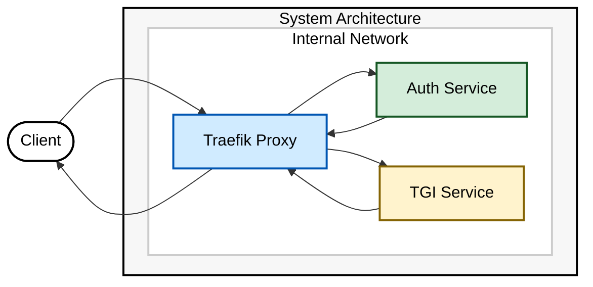

# TGI Models Collection

Welcome to `xpu_tgi`! 🚀  
A curated collection of Text Generation Inference (TGI) models optimized for Intel XPU, featuring token-based request handling and traffic management.

---

## 🚀 Quick Deploy

Deploy a model with a single command. The script will generate an authentication token automatically for secure access.

```bash
curl -sSL https://raw.githubusercontent.com/tiberaicommunity/xpu_tgi/main/quick-deploy.sh | bash -s -- CodeLlama-7b
```

### What this does:
1. 🔒 Generates a secure `VALID_TOKEN` for authentication.
2. 🚀 Deploys the selected model (e.g., `CodeLlama-7b`).
3. 🌐 Outputs the endpoint and token details for immediate use.

---

## ⚙️ Deployment Options

### 🏃 Standard Deployment
```bash
# Generate authentication token
export VALID_TOKEN=$(./utils/generate_token.py)

# Deploy the model
./deploy.sh CodeLlama-7b

# Check service status
./tgi-status.sh
```

### 🛠️ Step-by-Step Deployment
```bash
# Check system requirements
./init.sh

# Setup network
./setup_network.sh

# Start base services
./start_base.sh

# Add and deploy the model
./add_model.sh CodeLlama-7b
```

---

## 📐 Architecture Overview

The architecture ensures secure and efficient request handling with token-based authentication, proxying, and load balancing.



---

## ✅ Test Your Deployment

Once deployed, you can test the service with a simple API request.

### Example Endpoint
🔗 Assume the model name is `hermes-2-pro-tgi`, running on GPU 0. The service will be available at:  
`http://localhost:8000/hermes-2-pro-tgi/gpu0/generate`

### Example API Request
```bash
curl -X POST http://localhost:8000/hermes-2-pro-tgi/gpu0/generate \
  -H "Authorization: Bearer your-valid-token" \
  -H "Content-Type: application/json" \
  -d '{"inputs": "Hello world!", "parameters": {"max_new_tokens": 10}}'
```

---

## 🔍 Monitoring and Troubleshooting

### 📊 Check Service Status
```bash
./tgi-status.sh
```

### 🛠️ View Logs
```bash
docker logs -f tgi_auth    # Authentication service logs
docker logs -f tgi_proxy   # Proxy service logs
docker logs -f <model_container>  # Model-specific logs
```

### 💻 GPU Monitoring
```bash
xpu-smi dump -m18  # Detailed memory info
xpu-smi -l         # Live monitoring
xpu-smi discovery  # List available GPUs
```

### ❓ Common Issues

#### 🚫 GPU Not Detected
```bash
# Check available GPUs
xpu-smi discovery
ls -l /dev/dri/
```

#### 🔑 Authentication Failures
```bash
# Verify token is set
echo $VALID_TOKEN
# Check authentication logs
docker logs -f tgi_auth
```

#### 🛑 Model Startup Issues
```bash
# View model logs
docker logs -f <model_container>
# Verify GPU memory availability
xpu-smi dump -m18
```

---

## Load Balancing

For instructions on how to set up multiple instances of the TGI service and load balance them, see [load-balancing.md](load-balancing.md).

___

## 🤝 Contributing

Contributions are welcome! Please submit a Pull Request or open an issue to discuss major changes.

---

## 📞 Support

- Check the troubleshooting section
- Review existing GitHub issues
- Open a new issue with detailed information about your problem
